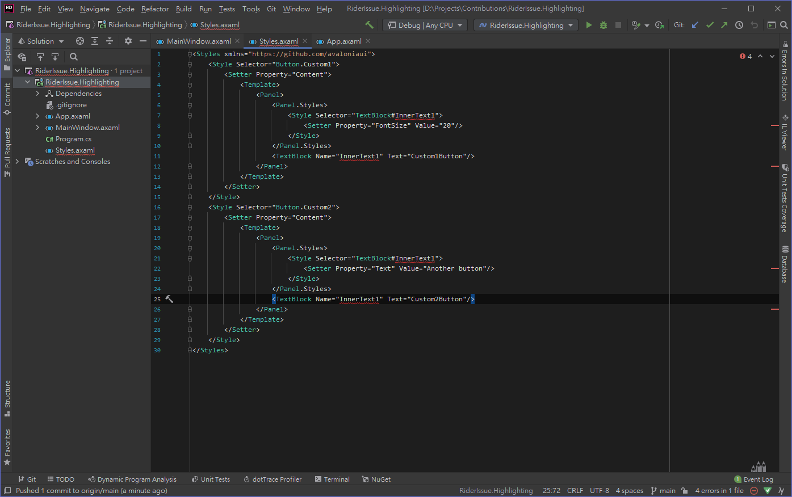
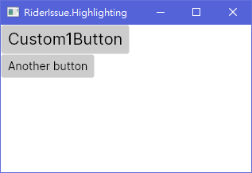

# RiderIssue.Highlighting
Sample project for issue https://youtrack.jetbrains.com/issue/RIDER-56905

In this project will reproduce highlighting issues on Avalonia xamls in JetBrains Rider 2020.3.2:
- Ambiguous reference
- Field is already declared

### Screenshots

PS: I cant reproduce "style class not found" bug, but not very critical at least.